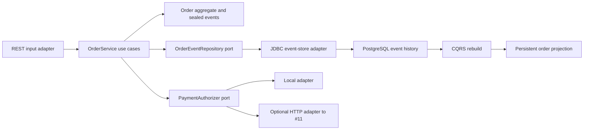

# #14 event-sourcing-orders: 205.34 events/s and 66.97 ms rebuild

**Claim:** a PostgreSQL append-only event store preserves order history across restarts, rejects stale writes, and rebuilds a durable CQRS read model.

**Benchmark:** median `205.34 events/s` append throughput and `66.97 ms` projection rebuild for `1,000` events, across three measured Docker runs after warm-up.

[](https://github.com/Brilhante29/event-sourcing-orders/actions/workflows/ci.yml)

## What It Proves

- PostgreSQL stores immutable events with `UNIQUE (aggregate_id, sequence)`.
- Expected stream versions enforce optimistic concurrency on every append.
- A deleted read model can be rebuilt from persisted history after process restart.
- The projection and its checkpoint are replaced in one database transaction.
- Java 21 sealed events interoperate with the Kotlin/Spring payments service through HTTP, not a shared database.
- The default path is local-first and needs no paid credential.

## Run Locally

Start the API, PostgreSQL, and the local deterministic payment adapter:

```powershell
docker compose up --build api
```

Create and authorize an order:

```http
POST /api/orders
Content-Type: application/json

{"customerName":"Ada","product":"Keyboard","quantity":1,"amountMinor":2590,"currency":"BRL"}
```

```http
POST /api/orders/{orderId}/authorize-payment
```

## Payments Integration

The `PaymentAuthorizer` output port has two adapters:

- `local` is the credential-free default and returns a deterministic payment ID.
- `http` calls #11 `POST /v1/payments` and accepts only `200` or `201`.

Run against #11 without sharing either database:

```powershell
$env:PAYMENTS_ADAPTER="http"
$env:PAYMENTS_BASE_URL="http://host.docker.internal:8081"
docker compose up --build api
```

The HTTP adapter sends `merchant_reference=<orderId>` and
`Idempotency-Key: order:<orderId>:authorize:v1`. Only a successful response
causes `OrderPaymentAuthorized` to be appended.

## Benchmark

```powershell
powershell -NoProfile -ExecutionPolicy Bypass -File tools/benchmark.ps1
```

Linux/macOS:

```bash
bash tools/benchmark.sh
```

| Metric | Median | Samples | Direction |
|---|---:|---|---|
| Append throughput | 205.34 events/s | 193.82 / 213.84 / 205.34 | higher |
| Projection rebuild | 66.97 ms | 88.77 / 66.97 / 37.60 | lower |
| Replayed events | 1,000 | 1,000 / 1,000 / 1,000 | exact |

Workload: 25 warm-up orders, then three isolated repetitions of 250 orders and
four events per order. The V2 result records workload digests, all samples,
image/source provenance, comparability key, and zero invariant failures in
`benchmarks/results/event-sourcing-orders-v2.json`.

## Architecture



Dependency direction:

```text
HTTP/JDBC/Flyway/Spring adapters -> application ports/use cases -> domain
```

There is no Kafka or Redpanda in this repository. Replay reads the event store;
asynchronous publication belongs to #20 `outbox-pattern`.

The versioned cross-repository envelope is
`contracts/commerce-event-v1.schema.json`: `eventId`, `eventType`,
`eventVersion`, `aggregateId`, `correlationId`, `causationId`, `occurredAt`, and
`payload`.

## Engineering Principles

- **SRP:** aggregate rules, command orchestration, persistence, projection, payments, and benchmark are separate.
- **OCP:** new persistence or payment adapters implement existing output ports.
- **LSP:** local and HTTP payment adapters return the same authorization contract.
- **ISP:** event, projection, and payment ports expose only use-case operations.
- **DIP:** use cases import ports; PostgreSQL, HTTP, and Spring remain outside the domain.
- **KISS/YAGNI:** one service, one PostgreSQL database, no broker, ORM, cloud SDK, or shared payment database.

## Verification

```powershell
docker compose up --build --abort-on-container-exit --exit-code-from integration-test integration-test
powershell -NoProfile -ExecutionPolicy Bypass -File tools/validate-project.ps1 -SkipDocker
```

## Limits

- The benchmark is single-threaded and local; it does not claim cluster throughput.
- Optimistic concurrency protects each aggregate stream, not cross-service atomicity.
- Payment authorization and event append are separate effects. The idempotency key makes retries safe, but this repo does not claim distributed exactly-once behavior.
- Authentication, inventory, refunds, and event publication are outside this slice.

## References

See `REFERENCES.md` for official documentation and licenses.
