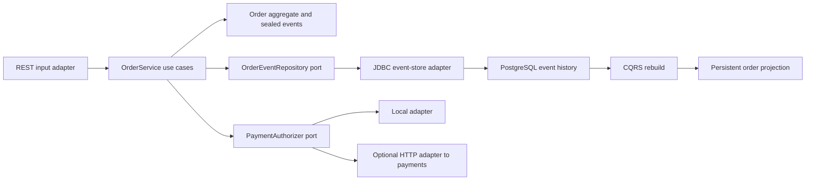

# Event-Sourced Orders: PostgreSQL Event Store with Rebuildable CQRS Projections

**Median `287.47 events/s` append throughput and `48.31 ms` projection rebuild** for `1,000` events, across three measured Docker runs after warm-up. Order history survives restarts, stale writes are rejected, and the read model can be deleted and rebuilt from events at any time.

[](https://github.com/Brilhante29/event-sourcing-orders/actions/workflows/ci.yml)
[](LICENSE)
  

## Why this exists

A table that holds only the current state of an order answers "what is it now?" and nothing else. Audits, disputes, and debugging ask "what happened, in which order, and who decided it?" Event sourcing answers both, but it is often demonstrated with in-memory stores that lose everything on restart and never face concurrent writers. This service uses PostgreSQL as a real event store:

- events are immutable rows with `UNIQUE (aggregate_id, sequence)`;
- every append carries the expected stream version, so concurrent writers get a conflict instead of silently overwriting each other;
- the CQRS read model can be dropped and rebuilt from history after a restart, and the projection plus its checkpoint are replaced in one transaction;
- payment authorization goes through a port with a local adapter by default and an HTTP adapter to [spring-hexagonal-payments](https://github.com/Brilhante29/spring-hexagonal-payments), with no shared database.

## Results

| Metric | Median | Samples | Direction |
|---|---:|---|---|
| Append throughput | 287.47 events/s | 222.66 / 287.47 / 296.79 | higher |
| Projection rebuild | 48.31 ms | 58.20 / 48.31 / 32.58 | lower |
| Replayed events | 1,000 | 1,000 / 1,000 / 1,000 | exact |

Workload: 25 warm-up orders, then three isolated repetitions of 250 orders with four events each. The V2 result records workload digests, all samples, image and source provenance, a comparability key, and zero invariant failures in [`benchmarks/results/event-sourcing-orders-v2.json`](benchmarks/results/event-sourcing-orders-v2.json). Appends are single-threaded and each one is a durable transaction, so throughput reflects commit latency, not cluster capacity.

## Quickstart

Start the API, PostgreSQL, and the local deterministic payment adapter:

```bash
docker compose up --build api
```

```http
POST /api/orders
Content-Type: application/json

{"customerName":"Ada","product":"Keyboard","quantity":1,"amountMinor":2590,"currency":"BRL"}
```

```http
POST /api/orders/{orderId}/authorize-payment
```

Run against the payments service instead of the local adapter:

```bash
PAYMENTS_ADAPTER=http PAYMENTS_BASE_URL=http://host.docker.internal:8081 docker compose up --build api
```

The HTTP adapter sends `merchant_reference=<orderId>` and `Idempotency-Key: order:<orderId>:authorize:v1`, and accepts only `200` or `201`. Only a successful response appends `OrderPaymentAuthorized`.

Benchmark: `bash tools/benchmark.sh` (or `tools/benchmark.ps1` with PowerShell 7).

## How it works


```mermaid
flowchart LR
  H["REST input adapter"] --> S["OrderService use cases"]
  S --> D["Order aggregate and sealed events"]
  S --> E["OrderEventRepository port"]
  S --> P["PaymentAuthorizer port"]
  E --> J["JDBC event-store adapter"]
  J --> DB["PostgreSQL event history"]
  P --> L["Local adapter"]
  P --> X["Optional HTTP adapter to payments"]
  DB --> R["CQRS rebuild"]
  R --> Q["Persistent order projection"]
```

Dependency direction: `HTTP/JDBC/Flyway/Spring adapters -> application ports/use cases -> domain`. Java 21 sealed events model the order lifecycle. The cross-repository envelope is versioned in [`contracts/commerce-event-v1.schema.json`](contracts/commerce-event-v1.schema.json) (`eventId`, `eventType`, `eventVersion`, `aggregateId`, `correlationId`, `causationId`, `occurredAt`, `payload`).

## Design decisions

| Decision | Why | Rejected |
|---|---|---|
| PostgreSQL as the event store | Durable, transactional, with a uniqueness constraint that enforces stream order | In-memory stores; a dedicated event-store product for one service |
| Optimistic concurrency per stream | Conflicts surface instead of lost updates | Last-write-wins |
| Projection and checkpoint in one transaction | A rebuild can never leave a half-updated read model | Separate commits |
| Java 21 for this service, Kotlin for payments | The integration is an HTTP contract, so each service picks its own language | Shared libraries or a shared database |
| No broker here | Replay reads the event store; publication is the job of [outbox-pattern](https://github.com/Brilhante29/outbox-pattern) | Kafka as the source of truth |

## Testing

```bash
docker compose up --build --abort-on-container-exit --exit-code-from integration-test integration-test
```

## Limitations

- Single-threaded, local benchmark; no cluster throughput claim.
- Optimistic concurrency protects each aggregate stream, not cross-service atomicity.
- Payment authorization and event append are separate effects; the idempotency key makes retries safe, but distributed exactly-once is not claimed.
- Authentication, inventory, refunds, and event publication are outside this slice.

## Project structure

```text
src/main/java/com/portfolio/eventsourcing/
  domain/           order aggregate, sealed events, service, event repository port
  application/      REST controller, CQRS projection, output ports
  infrastructure/   JDBC event and projection stores, payment adapters, serializer
  benchmark/        append and rebuild workload
src/main/resources/db/migration/   Flyway schema
contracts/          versioned commerce event envelope
benchmarks/  tools/ results, benchmark harness, validators
sdd/  openspec/     decisions, benchmark plan, handoff
```

## How this repository is built

The project follows the spec-driven workflow of [portfolio-reuse-kit](https://github.com/Brilhante29/portfolio-reuse-kit). Requirements and decisions live in [`sdd/`](sdd) and [`openspec/`](openspec), and [`project.yaml`](project.yaml) records the architecture, stack, and rejected alternatives. Development is AI-assisted and human-governed: [`AGENTS.md`](AGENTS.md) and [`CLAUDE.md`](CLAUDE.md) hold the coding-agent instructions, while tests, validators, and CI decide what gets published.

## Related work

- [spring-hexagonal-payments](https://github.com/Brilhante29/spring-hexagonal-payments): the payment authorization contract this service calls.
- [outbox-pattern](https://github.com/Brilhante29/outbox-pattern): reliable publication of domain events.
- [saga-orchestrator](https://github.com/Brilhante29/saga-orchestrator): compensation when an order spans several resources.

See [`REFERENCES.md`](REFERENCES.md) for official documentation and licenses.

## Author

**Guilherme Brilhante**, software engineer working on scalable backends and production AI.
[LinkedIn](https://www.linkedin.com/in/guilhermefreirebrilhanteseveriano/) · [GitHub](https://github.com/Brilhante29) · [Publications](https://dblp.org/pid/353/6812.html)

## License

[MIT](LICENSE).
